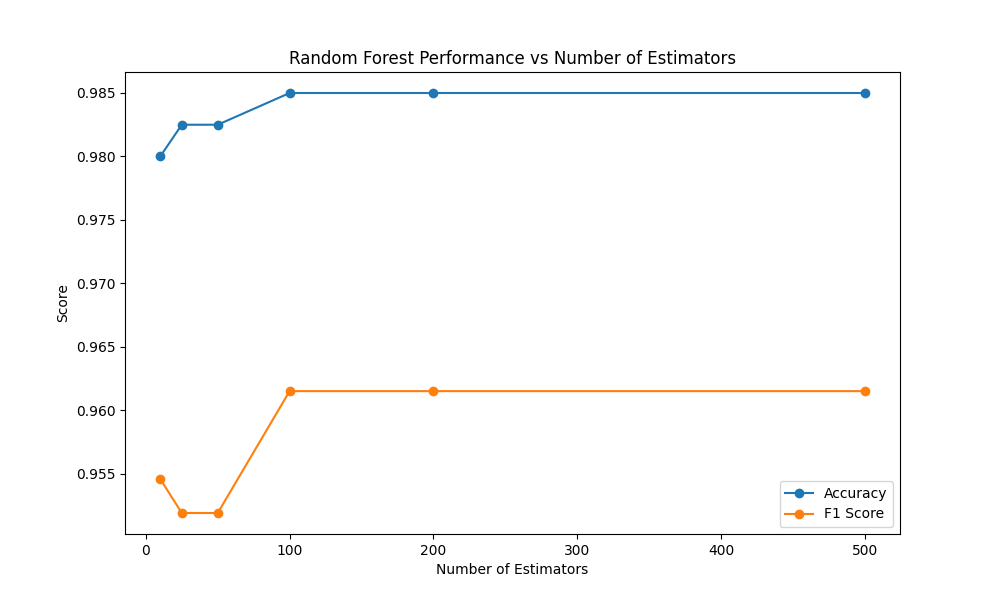
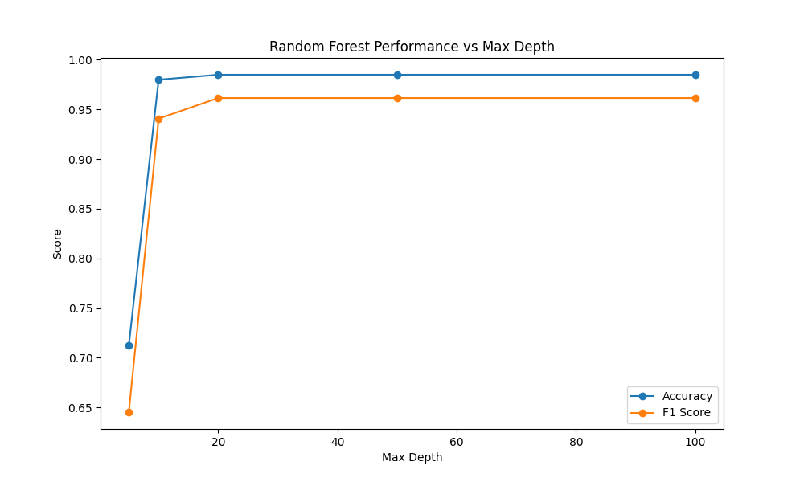
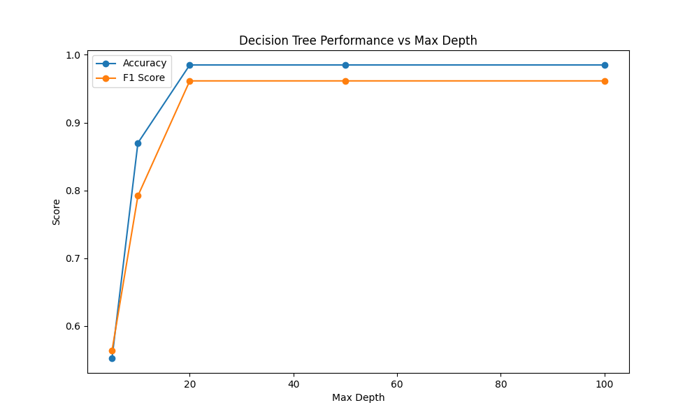
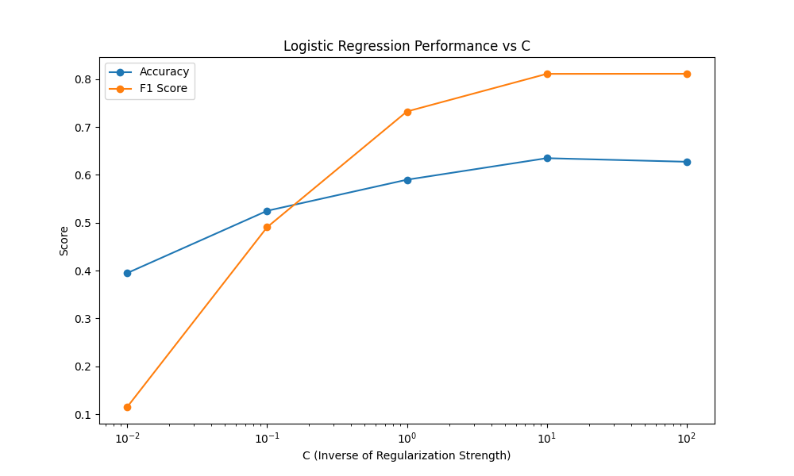
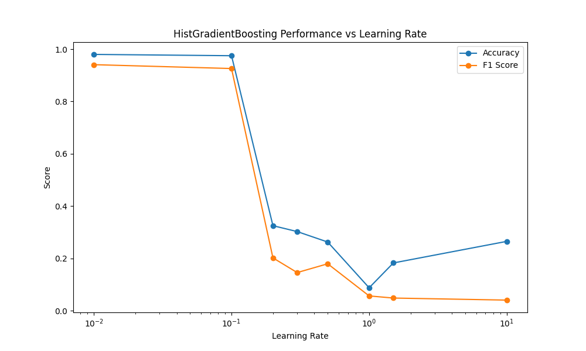
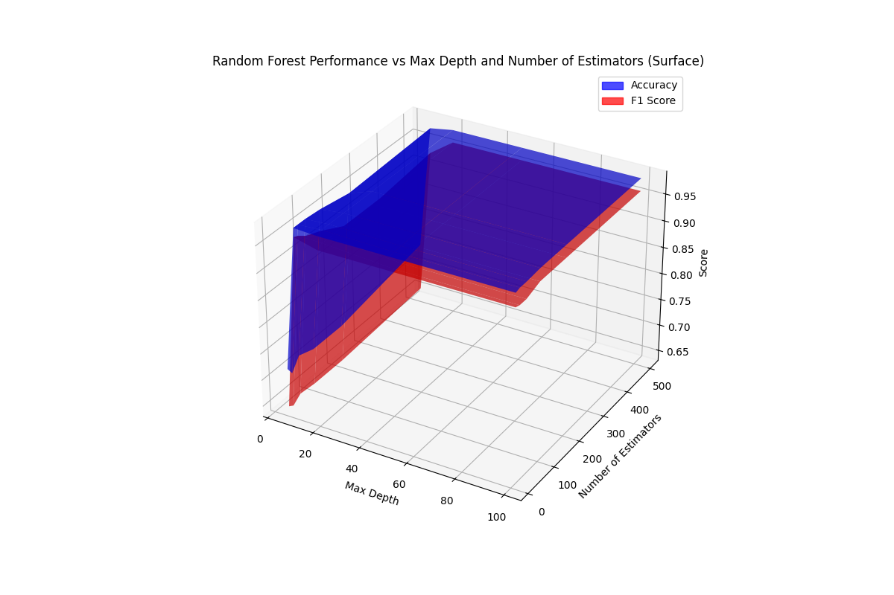

# Porównanie efektywności modeli uczenia maszynowego w klasyfikacji zdrowia psychicznego

**Autorzy:** Kinga Adamska **(wpisz tu swuj index bo mi sie sprawdzac nie chce xd)**, Roch Mykietów 284240

---

## 1. Charakterystyka problemu

### Definicja problemu

Problem badawczy polega na przewidywaniu i klasyfikacji typu depresji (`Depression_Type`) na podstawie danych zebranych w zbiorze "Mental Health Classification.csv". Głównym celem systemu jest zbudowanie optymalnego modelu predykcyjnego, który potrafi z jak najwyższą skutecznością zaklasyfikować przypadek w oparciu o zebrane cechy diagnostyczne, bazujące na stylu życia i demografii.

Aby zapewnić rzetelność oceny, przed przystąpieniem do uczenia wykluczono atrybuty mogące powodować bezpośredni wyciek informacji o zmiennej docelowej (tzw. _data leakage_), takie jak `Depression_Score`, `Symptoms`, `Nervous_Level` czy `Coping_Methods`.

### Złożoność problemu i metodyka

Z uwagi na złożoność i wielowymiarowość danych medycznych oraz psychologicznych, relacje między cechami a zmienną wynikową mają charakter silnie nieliniowy. W celu rozwiązania problemu zrezygnowano z tradycyjnych systemów opartych o eksperckie bazy reguł (np. systemy Fuzzy Logic), przechodząc do uczenia maszynowego (ML). Zastosowanie uczenia nadzorowanego ma na celu zautomatyzowane odkrycie wzorców występujących w dużej ilości danych z możliwie wysoką generalizacją.

---

## 2. Stosowane modele uczenia maszynowego

Dla oceny możliwości rozpoznawania wzorców użyto i porównano ze sobą 4 popularne modele uczenia maszynowego:

1. **Regresja logistyczna (Logistic Regression):**
   Podstawowy, liniowy model klasyfikacyjny. Działa poprzez oszacowanie prawdopodobieństwa przynależności do danej klasy na podstawie liniowej kombinacji cech wejściowych, a następnie przepuszczenie wyniku przez funkcję sigmoidalną.
2. **Drzewo decyzyjne (Decision Tree):**
   Algorytm dokonujący hierarchicznego, binarnego podziału przestrzeni cech wejściowych aż do osiągnięcia jednorodnych klas w tzw. liściach. Model cechuje się wysoką interpretowalnością, ale jest podatny na przeuczenie.
3. **Las losowy (Random Forest):**
   Metoda zespołowa (ang. _ensemble method_) łącząca wyniki wielu niezależnych drzew decyzyjnych (tzw. zjawisko "mądrości tłumu"). Dzięki uśrednianiu, wariant ten znacząco redukuje ryzyko przeuczenia i wariancję, zachowując przy tym wysoką moc predykcyjną.
4. **Gradient Boosting oparty o histogramy (HistGradientBoosting):**
   Algorytm sekwencyjny budujący kolejne drzewa tak, by korygować błędy popełniane przez swoich poprzedników. Optymalizacja histogramowa pozwala znacząco przyspieszyć proces tworzenia wezłów i podziału zbiorów dla dużych wolumenów danych.

---

## 3. Testy parametrów algorytmów

Dla wszystkich przetestowanych modeli wykonano eksperymenty dostrajania hiperparametrów metodą optymalizacji wrażliwości w celu znalezienia kompromisu dla jak najwyższej precyzji w odniesieniu do metryk **Accuracy** (Dokładność) oraz **F1 Score**.

### 3.1 Random Forest: Liczba estymatorów (`n_estimators`)

Badanie wpływu liczby wykorzystanych drzew w zespole na jakość końcowej klasyfikacji.

| Liczba estymatorów | Accuracy | F1 Score |
| :----------------- | :------- | :------- |
| 10                 | 0.9800   | 0.9546   |
| 25                 | 0.9825   | 0.9519   |
| 50                 | 0.9825   | 0.9519   |
| 100                | 0.9850   | 0.9615   |
| 200                | 0.9850   | 0.9615   |
| 500                | 0.9850   | 0.9615   |

**Analiza:**
Skuteczność klasyfikacji ulega znacznej poprawie na początku wzrostu wielkości lasu i osiąga swój optymalny pułap około 100 estymatorów (Accuracy 98.5%). Zwiększanie rozmiaru lasu powyżej 100 drzew decyzyjnych marnuje jedynie czas i zasoby obliczeniowe nie wnosząc żadnej poprawy do wskaźników jakości klasyfikacji.

### 3.2 Random Forest: Maksymalna głębokość (`max_depth`)

Analiza zachowania złożoności modelu determinowanej przez maksymalną głębokość drzew składowych.

| Maksymalna głębokość | Accuracy | F1 Score |
| :------------------- | :------- | :------- |
| 5                    | 0.7125   | 0.6453   |
| 10                   | 0.9800   | 0.9408   |
| 20                   | 0.9850   | 0.9615   |
| 50                   | 0.9850   | 0.9615   |
| 100                  | 0.9850   | 0.9615   |

**Analiza:**
Płytkie drzewa (głębokość 5) są niedouczone (ang. _underfitting_) i osiągają relatywnie niskie rezultaty (Accuracy: 71.2%). Dopiero zagłębienie drzew od ok. 20 poziomów zapewnia najwyższą, stabilną jakość wyników (98.5%).

### 3.3 Decision Tree: Maksymalna głębokość (`max_depth`)

Taki sam parametr jak powyżej przetestowano dla pojedynczego drzewa decyzyjnego.

| Maksymalna głębokość | Accuracy | F1 Score |
| :------------------- | :------- | :------- |
| 5                    | 0.5525   | 0.5637   |
| 10                   | 0.8700   | 0.7920   |
| 20                   | 0.9850   | 0.9615   |
| 50                   | 0.9850   | 0.9615   |
| 100                  | 0.9850   | 0.9615   |

**Analiza:**
Pojedyncze drzewo jest jeszcze mocniej czułe na zbyt duże ograniczenie swojej struktury (głębokość 5 to zaledwie Accuracy 55.25%). Pozwolenie drzewu na optymalny rozwój struktury decyzyjnej do 20 poziomów zrównuje jego wynik z modelem Random Forest (Accuracy: 98.5%).

### 3.4 Logistic Regression: Odwrotność siły regularyzacji (`C`)

Wpływ hiperparametru regularyzacji (przeciwdziałania przeuczeniu wektorów wag) na trafność modelu liniowego.

| C (odwrotność siły) | Accuracy | F1 Score |
| :------------------ | :------- | :------- |
| 0.01                | 0.3950   | 0.1152   |
| 0.1                 | 0.5225   | 0.4921   |
| 1.0                 | 0.5900   | 0.7293   |
| 10.0                | 0.6250   | 0.8067   |
| 100.0               | 0.6225   | 0.8080   |

**Analiza:**
Regresja logistyczna radzi sobie bardzo słabo z postawionym wyzwaniem ze względu na swoje nieliniowe ograniczenia, osiągając maksymalnie zaledwie 62.5% dokładności klasyfikacji (dla wartości współczynnika C = 10.0, gdzie silniejsza regularyzacja dusi proces uczenia, a słabsza nie polepsza już dopasowania do wariancji).

### 3.5 HistGradientBoosting: Współczynnik uczenia (`learning_rate`)

Wrażliwość współczynnika optymalizacji procesu gradientowego w iteracyjnym budowaniu drzew.

| Learning Rate | Accuracy | F1 Score |
| :------------ | :------- | :------- |
| 0.01          | 0.9800   | 0.9408   |
| 0.1           | 0.9750   | 0.9260   |
| 0.2           | 0.3250   | 0.2018   |
| 0.5           | 0.2625   | 0.1793   |
| 1.0           | 0.0875   | 0.0564   |
| 10.0          | 0.2650   | 0.0404   |

**Analiza:**
Kluczem do optymalnego gradient boostingu okazały się bardzo niskie wartości współczynnika uczenia. Optymalną wydajność osiągnięto przy bardzo wolnym uczeniu i dopasowywaniu wag `learning_rate` na poziomie zaledwie 0.01 (Accuracy 98%). Znaczne podniesienie progu nauki doprowadza szybko do "wystrzelenia" i utraty sterowności po funkcji błędu (drastyczny spadek dokładności już przy LR=0.2).

---

## 4. Porównanie działania algorytmów (Optymalizacja przestrzeni wielowymiarowej)

Poniżej zamieszczono dodatkowy wykres wizualizujący zachowanie jakości modelu algorytmu Random Forest na podstawie manipulacji wielowymiarowej uwzględniając na raz głębokość w korelacji z ilością estymatorów.

Przestrzeń poszukiwań potwierdza zjawisko stabilnego płaskowyżu. Najwyższa jakość gwarantowana jest dla rozwiązań odciętych z głębokością ponad 20 oraz wielkością lasu powyżej 100 składowych.

---

## 5. Wnioski i podsumowanie

Zestawienie całościowe wskazuje bezsprzecznie na fakt wyższości skomplikowanych i złożonych struktur modeli opartych na zespołach nieliniowych modeli decyzyjnych do klasyfikacji problemu zdrowia psychicznego na podstawie atrybutów życiowych:

- **Przewaga opartych na drzewach modeli nad modelami liniowymi**: Algorytmy Random Forest, Decision Tree czy HistGradientBoosting operują na sprawności oscylującej wokół wskaźnika 98,5%. Dla porównania uwarunkowany liniowo model Logistic Regression ma wynik słabszy rzędu ~62.5%. To dowodzi ewidentnego i złożonego nieliniowego splotu atrybutów.
- **Rozsądek parametrów**: Wykresy badające wrażliwość na parametry dowiodły kluczowego zjawiska, według którego zbyt złożone algorytmy i duże wielkości parametrów wcale nie przynoszą korzyści z przeuczenia. Stabilność modeli typu Random Forest i Decision Tree stabilizuje się dla racjonalnych wielkości jak 100 drzew czy 20 węzłów podziałów w głębokości – zyskując zarówno na sprawności czasowej jak i klasyfikacji.
- **Rekomendacja końcowa:** Jako rozwiązanie bazowe dla przewidywania poziomu i typu załamania nerwowego czy zjawiska depresji rekomenduje się w pełni model zespołu Lasu Losowego (**Random Forest**). Oprócz posiadania uśrednionego kompromisu wysokiej jakości predykcji zabezpiecza on strukturę przed przeuczeniem o wiele efektywniej niż pojedyncze głębokie Drzewo Decyzyjne pomimo równego wyniku dla obydwu.
